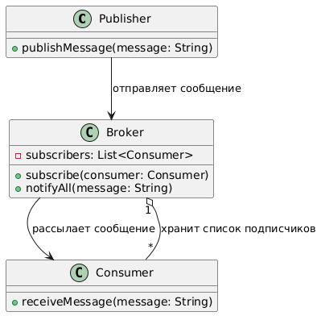
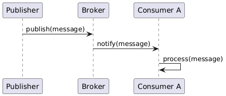

# Паттерн Наблюдатель (Observer)

## 📘 Обзор

В этом задании студенты реализуют **паттерн Наблюдатель (Observer Pattern)**, чтобы смоделировать работу системы обмена сообщениями по принципу брокера.
Цель — помочь студентам понять, как работает **асинхронный обмен сообщениями** между сервисами **без использования внешнего брокера**.

---

## 🧩 Структура проекта

Необходимо создать **три отдельных сервиса**:

1. **Publisher (Издатель)** — отправляет новые сообщения брокеру.
2. **Consumer (Подписчик)** — получает и обрабатывает входящие сообщения.
3. **Broker (Брокер)** — управляет подписчиками и уведомляет их о новых сообщениях.

---

## ⚙️ Основные требования

### Broker Service

* Реализует **паттерн Наблюдатель**.
* Предоставляет API эндпоинты:

    * `POST /subscribe` — регистрация нового подписчика.
    * `POST /notify` — рассылка сообщения всем подписчикам.

### Publisher Service

* Предоставляет эндпоинт:

    * `POST /publish` — отправка нового сообщения брокеру через его API.

### Consumer Service

* Предоставляет эндпоинт:

    * `POST /receive` — получение и обработка сообщения от брокера.

---

## 🔁 Логика обмена сообщениями

1. **Consumer** регистрируется у **Broker** через `/subscribe`.
2. **Publisher** отправляет сообщение **Broker** через `/publish`.
3. **Broker** уведомляет всех зарегистрированных **Consumers**, вызывая их эндпоинт `/receive`.

---

## 🧠 Цели обучения

* Понять структуру и принципы **паттерна Наблюдатель**.
* Научиться реализовывать **асинхронное взаимодействие** без использования реального брокера.
* Смоделировать поведение **Publish–Subscribe** с помощью API-взаимодействия между сервисами.

---

## 🧱 Диаграммы

### Класс-диаграмма

### Диаграмма последовательности

---

## ✅ Ожидаемый результат

После выполнения задания студенты:

* Смогут реализовать взаимодействие между тремя сервисами через REST API;
* Поймут, как работает асинхронная передача данных и механизм подписки;
* Осознают, что паттерн **Observer** является концептуальной основой для систем типа **message broker**.
